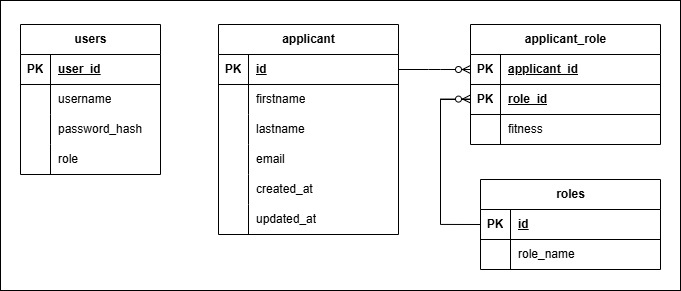

# **AI-Powered Resume Parsing System**

---

## **Project Description**
ResumeParser is a Spring Boot application that leverages the OpenAI API to parse and analyze raw resume text. The parsed data (such as first name, last name, email, roles, and fitness scores) is then stored in a PostgreSQL database. The project provides a set of RESTful API endpoints for creating, retrieving, updating, and deleting applicant records, complete with JWT authentication to protect sensitive operations.

👉 **This is a demo project** showcasing how to build a secure API that connects to a PostgreSQL database.  
---

## **Features**
- **Resume Text Parsing (via OpenAI API)**: Upload text input and let OpenAI extract key applicant data.  
- **CRUD Operations**: Create, read, update, and delete applicant records.  
- **Role Fitness**: Track applicants’ suitability for different roles using a numerical “fitness” score.  
- **JWT Authentication**: Secure endpoints for user registration, login, and role-based access.  
- **Swagger UI**: Easily explore and test all endpoints in a web-based interface.

---

## 🛠️ **Tech Stack**
- **Java** (Spring Boot)  
- **PostgreSQL**  
- **OpenAI API**  
- **JWT** for authentication  
- **Maven** for dependency management

---

## 🖥️ **Setup Instructions**

### 1. Clone the Repository
```bash
git clone https://github.com/your-username/ResumeParser.git
cd ResumeParser
```

### 2. Install Dependencies
Ensure you have **Maven** installed. Then, run:
```bash
mvn clean install
```

### 3. Set Up the Database
1. Create a PostgreSQL database (for instance, `resumeparser_db`).  
2. Update the connection details in `src/main/resources/application.properties` or set environment variables:
   ```properties
   spring.datasource.url=jdbc:postgresql://localhost:5432/resumeparser_db
   spring.datasource.username=postgres
   spring.datasource.password=YOUR_PASSWORD
   ```
3. Run the provided **SQL schema** (in `resumeparser.sql`) on your database to create the required tables.

### 4. Enter OpenAI API Token at Startup
When you run the application, you will be prompted to provide your OpenAI API token:
```bash
Enter OpenAI API Key:
```

The application will start on `http://localhost:8080`.

---

## 📁 **Additional Resources**
- **Postman Collection:** Easily import and test the API using the provided [Postman collection](postman/resumeparser.postman_collection.json) file.
- **Entity-Relationship Diagram (ERD):** Visualize the database structure with the included ERD diagram.
- **SQL Schema:** The database schema and sample data can be found in [resumeparser.sql](database/resumeparser.sql).
- **API Documentation:** The detailed API design and user stories are documented in [API_design.md](design/API_design.md) and [user_stories.md](design/user_stories.md).

---

## 📂 **Project Structure**

```plaintext
ResumeParser/
│
├── src/
│   ├── main/
│   │   ├── java/com/example/resumeparser
│   │   │   ├── apidoc
│   │   │   ├── controller
│   │   │   ├── dao
│   │   │   ├── exception
│   │   │   ├── model
│   │   │   ├── security
│   │   │   ├── service
│   │   │   └── ResumeparserApplication.java
│   │   └── resources
│   │       ├── application.properties
│   └── test/
│
├── design/
│   ├── resumeparser_ERD.jpg
│   ├── API_design.md
│   └── user_stories.md
│
├── postman/
│   └── resumeparser.postman_collection.json
│
├── database/
│   └── resumeparser.sql
│
├── README.md
└── pom.xml
```

---

## 🔮 **Future Improvements**
- Implement front-end interface using React or Angular.
- Add more advanced resume parsing using NLP techniques.
- Introduce analytics and reporting for parsed resume data.
- Improve error handling and validation for API requests.

---

## 📊 **Entity-Relationship Diagram (ERD)**


---

## 📢 **Contributing**
Contributions are welcome! To contribute:
1. Fork this repository.
2. Create a new branch (`feature/awesome-improvement`).
3. Commit and push your changes.
4. Open a pull request on GitHub describing your changes.

---

## 📜 **License**
This project is **open-source** under the **MIT License**.  
Feel free to **modify, enhance, and contribute**!  

---

## 🔗 **Contact & Credits**
Created by **Kamran Makarian** – feel free to **connect & contribute**!
- **GitHub**: [KamranMakarian](https://github.com/KamranMakarian)  

---

**Thank you for using ResumeParser!** If this project helps you, please star the repo on GitHub and share with others.

